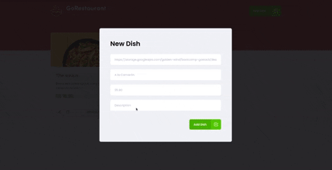

<!-- Logotipo -->
<div align="center">
  
</div>

<!-- Title -->
<h1 align="center"> Rocketseat 🔥 Ignite ReactJS </h1>

<!-- Preview -->
<div align="center">
  
</div>

<!-- Sobre o Projeto -->

## 🧐 Sobre o Projeto

O Go Restaurant é um dos desafio proposto pela Rocketseat na trilha de ReactJS do Ignite da Rocketseat.

A aplicação é uma página web para cadastro, edição e listagem de pratos de um restaurante. Nela você pode inserir ou alterar os pratos, com imagem, nome, descrição e valor, bem como sinalizar a disponibilidade do mesmo. Também é possível realizar a remoção de pratos cadastrados.

Ela foi feita utilizando React e Typescript e o servidor utilizado é do tipo Fake API com JSON Server.

## 🚀 Tecnologias e Bibliotecas

- [React](https://reactjs.org)
- [TypeScript](https://www.typescriptlang.org/)
- [JSON Server](https://www.npmjs.com/package/json-server)
- [Styled Components](https://styled-components.com/)
- [Axios](https://www.npmjs.com/package/axios)
- [React-Router-Dom](https://reactrouter.com/web/guides/quick-start)
- [Yup](https://www.npmjs.com/package/yup?activeTab=readme)

## 💻 Rodando o Projeto

```
# Abra um terminal e copie este repositório com o comando
$ git clone https://github.com/lucasbarque/GoRestaurant.git

# Acesse a pasta da aplicação
$ cd GoRestaurant

# Instale as dependências
$ yarn

# Rode o servidor
$ yarn server

# Inicie a aplicação
$ yarn start

```

© 2022 GitHub, Inc.
Terms
Privacy
Security
Stat
